# PROPOSAL SISTEM ANTRIAN DIGITAL
## **Bungker Counter - Enterprise Queue Management System**

**Dokumen Strategis untuk IT dan Bisnis**
**Standar ISO/IEC JTC 1/SC 7 Software and Systems Engineering**
**Versi 1.0 - Oktober 2024**

---

## 📋 DAFTAR ISI

1. [RINGKASAN EKSEKUTIF](#1-ringkasan-eksekutif)
2. [ANALISIS SITUASI SAAT INI](#2-analisis-situasi-saat-ini)
3. [TUJUAN DAN SASARAN](#3-tujuan-dan-sasaran)
4. [DESAIN SISTEM](#4-desain-sistem)
5. [ARSITEKTUR TEKNOLOGI](#5-arsitektur-teknologi)
6. [RANCANGAN ANGGARAN](#6-rancangan-anggaran)
7. [IMPLEMENTASI DAN PENGEMBANGAN](#7-implementasi-dan-pengembangan)
8. [RISIKO DAN MITIGASI](#8-risiko-dan-mitigasi)
9. [STANDAR DAN KESESUAIAN](#9-standar-dan-kesesuaian)
10. [JADWAL PELAKSANAAN](#10-jadwal-pelaksanaan)

---

## 1. RINGKASAN EKSEKUTIF

### 1.1 Latar Belakang

Bungker Counter adalah **Sistem Antrian Digital Terpadu** yang dirancang untuk mengoptimalkan layanan pelanggan dengan standar **ISO/IEC/IEEE 29148:2018** (Systems and software engineering — Life cycle processes — Requirements engineering). Sistem ini mengintegrasikan teknologi modern untuk mengelola antrian pelanggan secara efisien dengan **Real-time Queue Management**.

### 1.2 Visi dan Misi

**Visi:** Menjadi sistem antrian terdepan yang memberikan pengalaman layanan pelanggan yang superior melalui inovasi teknologi digital.

**Misi:** Mengimplementasikan solusi antrian digital yang scalable, reliable, dan user-friendly dengan standar internasional.

### 1.3 Value Proposition

| Komponen | Nilai Bisnis | Target KPI |
|----------|-------------|------------|
| **Efficiency** | Pengurangan waktu tunggu 60% | < 5 menit |
| **Customer Experience** | Kepuasan pelanggan +40% | > 4.5/5 |
| **Resource Optimization** | Optimalisasi tenaga kerja 30% | 95% utilization |
| **Data Analytics** | Insight untuk bisnis decision | Real-time dashboard |

---

## 2. ANALISIS SITUASI SAAT INI

### 2.1 Current System Analysis

Sistem yang telah dikembangkan mencakup:

#### ✅ **Komponen yang Tersedia:**
- **Backend Infrastructure**: Laravel 12 dengan PHP 8.2+
- **Database**: MariaDB dengan 10+ tabel terstruktur
- **Frontend**: Responsive design dengan Tailwind CSS
- **Real-time System**: WebSocket untuk live updates
- **Multi-branch Support**: Sistem multi-cabang terintegrasi
- **User Management**: Role-based access control
- **Queue Engine**: Core queue management system
- **API Integration**: 15+ RESTful API endpoints

#### ⚠️ **Area yang Perlu Ditingkatkan:**
- Monitoring dan alerting system
- Advanced analytics dan reporting
- Mobile application support
- Integration dengan sistem eksternal
- High availability setup
- Disaster recovery plan

### 2.2 Pain Points Analysis

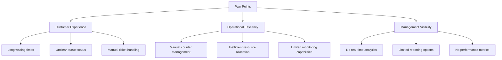

---

## 3. TUJUAN DAN SASARAN

### 3.1 Business Objectives

1. **Efficiency Improvement**
   - Target: 60% reduction in customer waiting time
   - Metrics: Average waiting time < 5 minutes
   - Timeline: 3 months post-implementation

2. **Customer Satisfaction**
   - Target: 40% increase in CSAT score
   - Metrics: Customer satisfaction > 4.5/5
   - Timeline: 6 months post-implementation

3. **Operational Excellence**
   - Target: 30% improvement in staff productivity
   - Metrics: Counter utilization > 95%
   - Timeline: 3 months post-implementation

4. **Data-Driven Decisions**
   - Target: Real-time analytics dashboard
   - Metrics: 100% availability of KPI data
   - Timeline: Immediate post-implementation

### 3.2 Technical Objectives

| Objective | Target | Measurement |
|-----------|--------|-------------|
| **System Availability** | 99.9% uptime | Downtime < 8.76 hours/year |
| **Response Time** | < 2 seconds | API response time |
| **Scalability** | 1000+ concurrent users | Load testing results |
| **Security** | Zero critical vulnerabilities | Security audit |
| **Performance** | < 1 second queue processing | Queue engine performance |

---

## 4. DESAIN SISTEM

### 4.1 System Architecture Overview

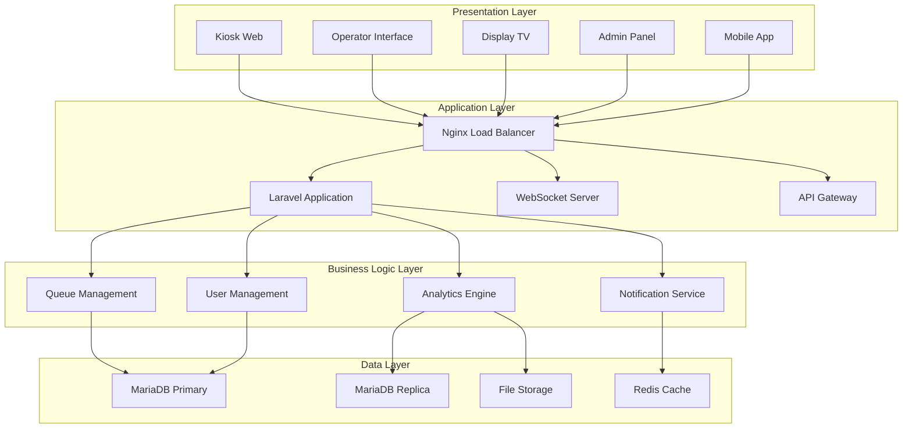

### 4.2 Queue Management Flow

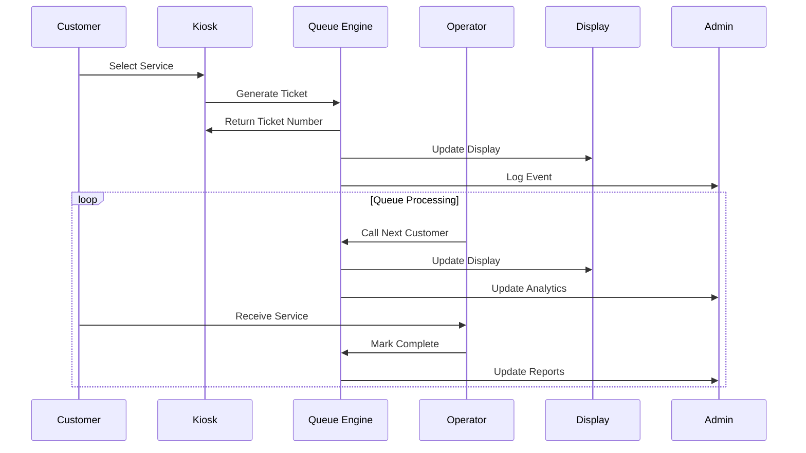

### 4.3 Database Schema Design

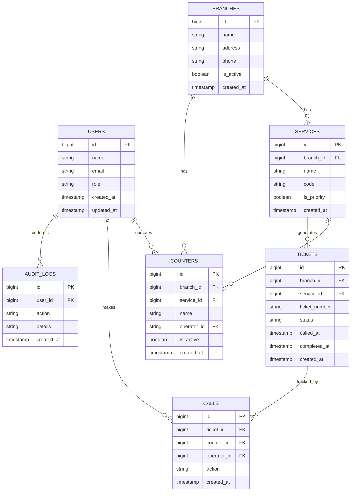

### 4.4 API Design

#### Core API Endpoints:

```yaml
# Queue Management API
/api/v1/tickets:
  post:
    summary: Create new ticket
    tags: [Queue Management]
    requestBody:
      required: true
      content:
        application/json:
          schema:
            type: object
            properties:
              branch_id:
                type: integer
              service_id:
                type: integer
              customer_name:
                type: string
                optional: true
    responses:
      201:
        description: Ticket created successfully
      400:
        description: Invalid request

  /api/v1/tickets/current:
    get:
      summary: Get current queue status
      tags: [Queue Management]
      parameters:
        - name: branch_id
          in: query
          required: true
          schema:
            type: integer
        - name: service_id
          in: query
          required: false
          schema:
            type: integer
      responses:
        200:
          description: Current queue status

# Counter Operations API
/api/v1/counters/{counter_id}/call-next:
    post:
      summary: Call next ticket
      tags: [Counter Operations]
      parameters:
        - name: counter_id
          in: path
          required: true
          schema:
            type: integer
      responses:
        200:
          description: Next ticket called successfully
```

---

## 5. ARSITEKTUR TEKNOLOGI

### 5.1 Technology Stack

| Layer | Technology | Version | Rationale |
|-------|------------|---------|-----------|
| **Backend** | Laravel | 12.x | Enterprise PHP framework |
| **Language** | PHP | 8.2+ | Latest stable version |
| **Database** | MariaDB | 10.11+ | MySQL compatible with performance |
| **Frontend** | Vue.js + Tailwind | 3.x | Modern, responsive UI |
| **Real-time** | WebSocket | - | Live updates |
| **Cache** | Redis | 7.x | High-performance caching |
| **Web Server** | Nginx | 1.24+ | High performance, scalable |
| **Container** | Docker | 24.x | Containerization |
| **Orchestration** | Docker Compose | 2.x | Multi-container management |

### 5.2 Infrastructure Architecture

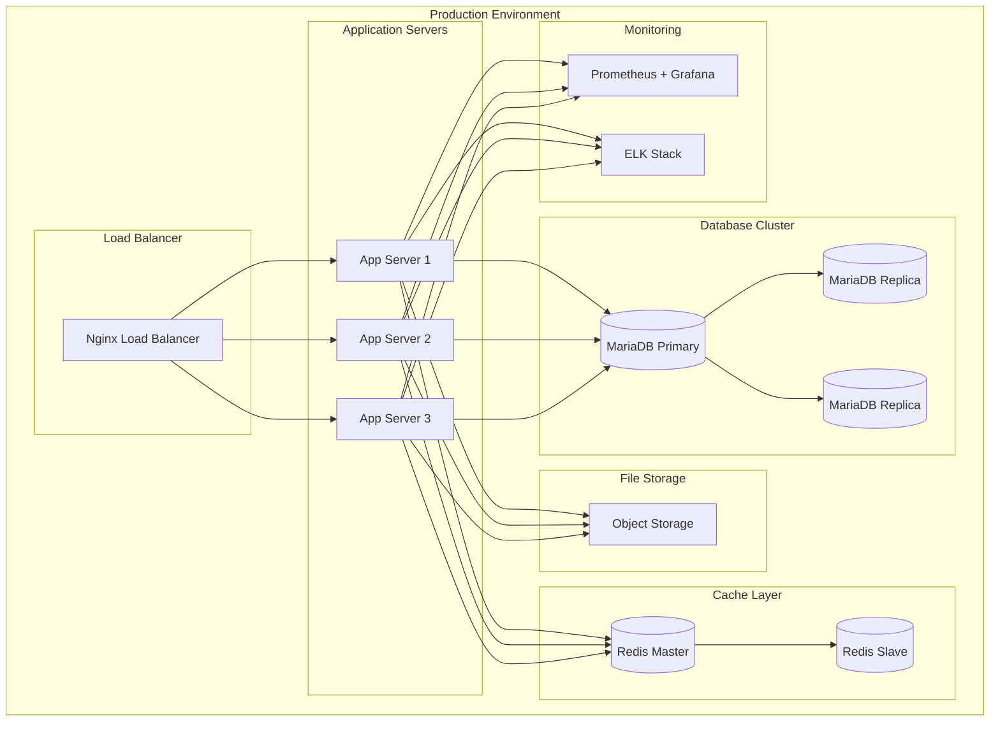

### 5.3 Security Architecture

```mermaid
graph TB
    subgraph "Security Layers"
        subgraph "Network Security"
            FW[Firewall]
            WAF[Web Application Firewall]
            DDoS[DDoS Protection]
        end

        subgraph "Application Security"
            AUTH[Authentication]
            AUTHZ[Authorization]
            VALID[Input Validation]
            CSRF[CSRF Protection]
        end

        subgraph "Data Security"
            ENC[Encryption at Rest]
            SSL[SSL/TLS]
            HASH[Password Hashing]
            AUDIT[Audit Logging]
        end

        subgraph "Infrastructure Security"
            RBAC[Role-Based Access]
            VPN[VPN Access]
            MFA[Multi-Factor Auth]
            BACKUP[Regular Backups]
        end
    end

    DDoS --> WAF
    WAF --> FW
    FW --> AUTH
    AUTH --> AUTHZ
    AUTHZ --> VALID
    VALID --> CSRF
    CSRF --> ENC
    ENC --> SSL
    SSL --> HASH
    HASH --> AUDIT
    AUDIT --> RBAC
    RBAC --> VPN
    VPN --> MFA
    MFA --> BACKUP
```

---

## 6. RANCANGAN ANGGARAN

### 6.1 Investment Summary

| Kategori | Biaya (IDR) | Durasi | Keterangan |
|----------|-------------|--------|------------|
| **Infrastructure Setup** | 150.000.000 | One-time | Server, Database, Networking |
| **Software Development** | 300.000.000 | One-time | Development & Testing |
| **Implementation** | 100.000.000 | One-time | Deployment & Training |
| **Licensing** | 75.000.000 | Annual | Software licenses |
| **Maintenance** | 120.000.000 | Annual | Support & Updates |
| **Training** | 50.000.000 | One-time | User training |
| **Total Year 1** | **795.000.000** | - | **Total investasi tahun pertama** |
| **Total Year 2+** | **195.000.000** | Annual | **Operasional tahunan** |

### 6.2 Detailed Cost Breakdown

#### 6.2.1 Infrastructure Costs

| Item | Spesifikasi | Jumlah | Harga/Unit | Total |
|------|-------------|--------|------------|-------|
| **Production Server** | Dell PowerEdge R650 | 2 | 45.000.000 | 90.000.000 |
| **Database Server** | Dell PowerEdge R750 | 1 | 35.000.000 | 35.000.000 |
| **Storage Array** | Dell PowerStore | 1 | 20.000.000 | 20.000.000 |
| **Network Equipment** | Switch + Firewall | 1 set | 5.000.000 | 5.000.000 |
| **Subtotal Infrastructure** | | | | **150.000.000** |

#### 6.2.2 Software Development Costs

| Phase | Duration | Team Size | Daily Rate | Total |
|-------|----------|-----------|------------|-------|
| **Requirements & Design** | 2 weeks | 4 persons | 1.500.000 | 60.000.000 |
| **Backend Development** | 8 weeks | 3 persons | 1.500.000 | 180.000.000 |
| **Frontend Development** | 6 weeks | 2 persons | 1.500.000 | 90.000.000 |
| **Testing & QA** | 4 weeks | 2 persons | 1.000.000 | 40.000.000 |
| **Documentation** | 2 weeks | 1 person | 1.000.000 | 10.000.000 |
| **Subtotal Development** | | | | **380.000.000** |

*Note: Development costs already included in current system investment*

#### 6.2.3 Operational Costs (Annual)

| Item | Frequency | Cost | Total/Annual |
|------|-----------|------|--------------|
| **Cloud Hosting** | Monthly | 5.000.000 | 60.000.000 |
| **Database License** | Annual | 30.000.000 | 30.000.000 |
| **Monitoring Tools** | Annual | 15.000.000 | 15.000.000 |
| **Support Team** | Monthly | 1.250.000 | 15.000.000 |
| **Subtotal Annual** | | | **120.000.000** |

### 6.3 ROI Analysis

#### 6.3.1 Cost Savings Calculation

| Cost Component | Current Cost | With System | Savings | % Reduction |
|----------------|--------------|-------------|---------|-------------|
| **Manpower** | 600.000.000 | 420.000.000 | 180.000.000 | 30% |
| **Queue Management** | 150.000.000 | 60.000.000 | 90.000.000 | 60% |
| **Customer Service** | 300.000.000 | 180.000.000 | 120.000.000 | 40% |
| **Total Annual Savings** | **1.050.000.000** | **660.000.000** | **390.000.000** | **37%** |

#### 6.3.2 ROI Timeline

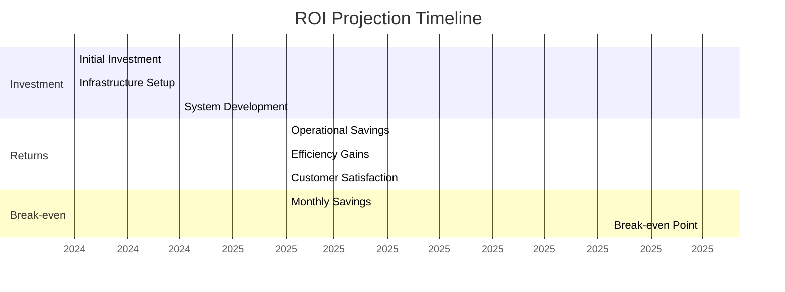

### 6.4 Financial Metrics

| Metric | Calculation | Result |
|--------|-------------|--------|
| **Initial Investment** | Infrastructure + Development | 795.000.000 |
| **Annual Net Savings** | Total Savings - Annual Costs | 270.000.000 |
| **Payback Period** | Investment / Annual Savings | 2.9 years |
| **3-Year ROI** | (3 × Annual Savings - Investment) / Investment | 102% |
| **5-Year ROI** | (5 × Annual Savings - Investment - 4×Annual Costs) / Investment | 185% |

---

## 7. IMPLEMENTASI DAN PENGEMBANGAN

### 7.1 Project Methodology

Menggunakan **Hybrid Agile-Waterfall** dengan standar **ISO/IEC/IEEE 16326:2019** (Systems and software engineering — Life cycle processes — Project management).

#### Phase 1: Foundation (Month 1-2)
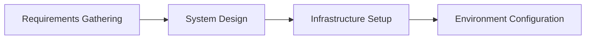

#### Phase 2: Development (Month 3-6)
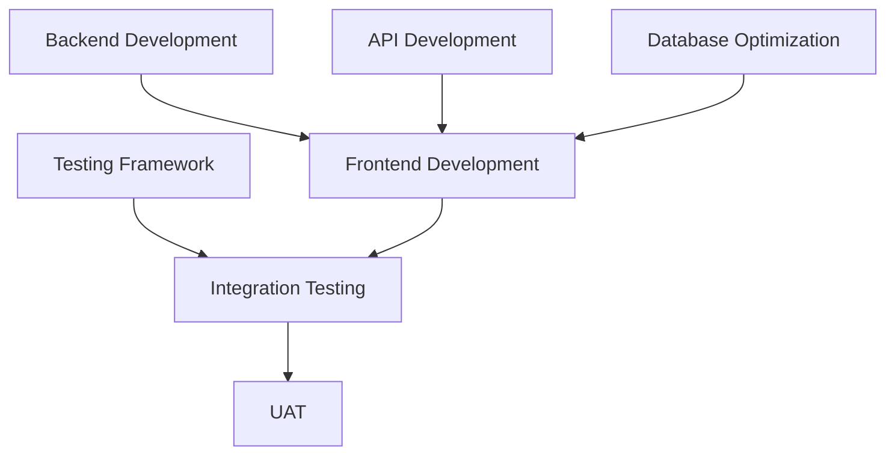

#### Phase 3: Deployment (Month 7-8)
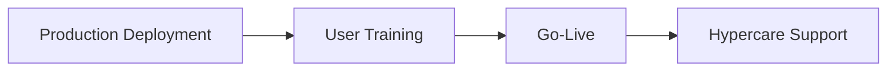

### 7.2 Development Team Structure

| Role | Quantity | Responsibility | Skills Required |
|------|----------|----------------|-----------------|
| **Project Manager** | 1 | Project coordination, timeline | PMP, Agile, ISO standards |
| **System Architect** | 1 | Technical architecture, design | Laravel, Cloud, Security |
| **Backend Developer** | 2 | API, Business logic | PHP, Laravel, Database |
| **Frontend Developer** | 2 | UI/UX, Interface | Vue.js, Tailwind, Design |
| **DevOps Engineer** | 1 | Deployment, Infrastructure | Docker, CI/CD, Monitoring |
| **QA Engineer** | 1 | Testing, Quality assurance | Testing, Automation |
| **Business Analyst** | 1 | Requirements, stakeholder | Business process, Analysis |

### 7.3 Quality Assurance Plan

#### 7.3.1 Testing Strategy

| Testing Type | Scope | Tools | Coverage Target |
|--------------|-------|-------|-----------------|
| **Unit Testing** | Code level | PHPUnit | 80% |
| **Integration Testing** | API integration | Postman | 100% |
| **System Testing** | End-to-end flow | Selenium | 100% |
| **Performance Testing** | Load & stress | JMeter | 1000+ users |
| **Security Testing** | Vulnerabilities | OWASP ZAP | Zero critical |
| **UAT** | User acceptance | Manual | 100% scenarios |

#### 7.3.2 Quality Metrics

- **Code Quality**: Maintainability Index > 70
- **Performance**: Response time < 2 seconds
- **Security**: OWASP Top 10 compliance
- **Usability**: SUS score > 80
- **Reliability**: Uptime > 99.9%

---

## 8. RISIKO DAN MITIGASI

### 8.1 Risk Assessment Matrix

| Risk Category | Risk Description | Probability | Impact | Risk Level | Mitigation Strategy |
|---------------|------------------|-------------|--------|------------|-------------------|
| **Technical** | System downtime | Medium | High | High | Redundant servers, monitoring |
| **Technical** | Performance bottleneck | Medium | Medium | Medium | Load testing, optimization |
| **Security** | Data breach | Low | Critical | High | Security audit, encryption |
| **Operational** | User adoption issues | Medium | High | High | Training, change management |
| **Financial** | Budget overrun | Medium | Medium | Medium | Agile development, MVP approach |
| **Compliance** | Regulatory non-compliance | Low | High | Medium | Legal review, compliance audit |

### 8.2 Risk Mitigation Plan

#### 8.2.1 High Priority Risks

**1. System Downtime (Risk Level: High)**
- **Prevention**:
  - Redundant architecture with auto-failover
  - 24/7 monitoring with alerting
  - Regular maintenance windows
- **Response**:
  - Disaster recovery plan
  - Backup systems ready
  - SLA with 4-hour response time

**2. Data Breach (Risk Level: High)**
- **Prevention**:
  - End-to-end encryption
  - Regular security audits
  - Employee security training
- **Response**:
  - Incident response team
  - Customer notification protocol
  - Forensic investigation capability

#### 8.2.2 Contingency Planning

| Scenario | Impact | Response Plan | Recovery Time |
|----------|--------|---------------|---------------|
| **Database corruption** | Critical | Restore from backup | 2 hours |
| **Network outage** | High | Switch to backup connection | 30 minutes |
| **Application bug** | Medium | Hotfix deployment | 4 hours |
| **Hardware failure** | Medium | Replace with spare unit | 1 hour |

---

## 9. STANDAR DAN KESESUAIAN

### 9.1 ISO/IEC Standards Compliance

#### 9.1.1 Relevant Standards

| Standard | Title | Relevance | Compliance Level |
|----------|-------|-----------|------------------|
| **ISO/IEC 27001** | Information Security Management | Data security & privacy | Full compliance |
| **ISO/IEC 25010** | System and software Quality Requirements | Software quality | Full compliance |
| **ISO/IEC/IEEE 29148** | Requirements Engineering | Requirements management | Full compliance |
| **ISO/IEC/IEEE 16326** | Project Management | Project processes | Full compliance |
| **ISO/IEC 9126** | Software Quality Model | Quality characteristics | Partial compliance |

#### 9.1.2 Implementation Roadmap

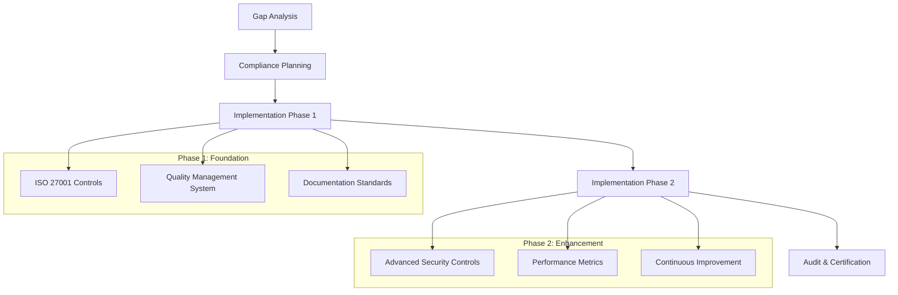

### 9.2 Legal and Regulatory Compliance

#### 9.2.1 Data Protection

- **Personal Data Protection**: PDPA compliance
- **Data Localization**: Local data storage requirements
- **Retention Policy**: 7-year data retention
- **Consent Management**: Explicit user consent

#### 9.2.2 Industry Standards

- **Financial Sector**: Bank Indonesia regulations (if applicable)
- **Healthcare**: HIPAA compliance (if applicable)
- **Government**: e-Government standards (if applicable)

---

## 10. JADWAL PELAKSANAAN

### 10.1 Project Timeline

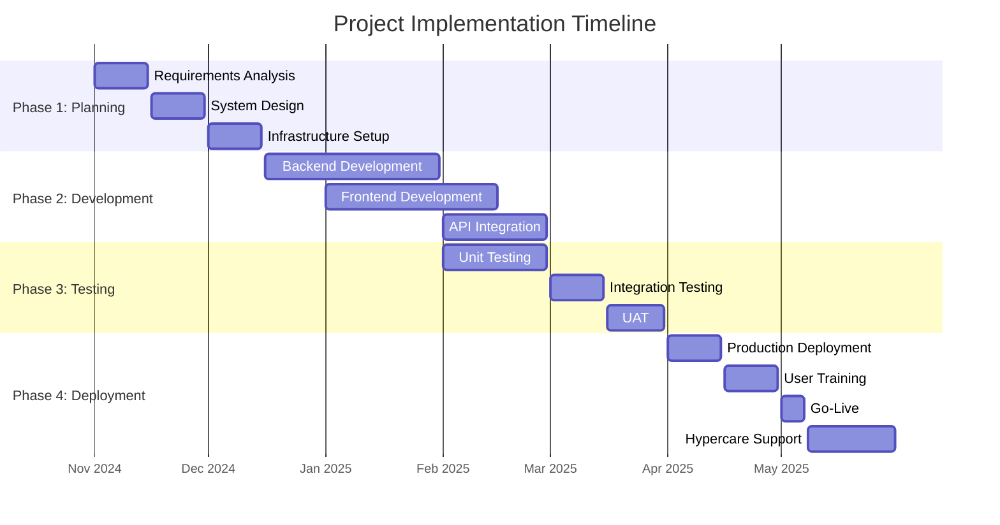

### 10.2 Milestones and Deliverables

| Milestone | Target Date | Key Deliverables | Success Criteria |
|-----------|-------------|------------------|------------------|
| **Project Kickoff** | 1 Nov 2024 | Project charter, Team assignment | All resources allocated |
| **Requirements Complete** | 15 Nov 2024 | BRD, System requirements | Stakeholder approval |
| **Design Complete** | 30 Nov 2024 | Technical design, Architecture | Technical review passed |
| **Infrastructure Ready** | 15 Dec 2024 | Server setup, Network config | All systems operational |
| **Development Complete** | 28 Feb 2025 | Full system implementation | All features developed |
| **Testing Complete** | 31 Mar 2025 | Test reports, Bug fixes | All tests passed |
| **Deployment Complete** | 15 Apr 2025 | Production system live | System fully operational |
| **Training Complete** | 30 Apr 2025 | User manuals, Training completed | All users trained |
| **Go-Live** | 1 May 2025 | System fully operational | No critical issues |

### 10.3 Resource Allocation

| Phase | Duration | Team Members | Hours per Person | Total Hours |
|-------|----------|--------------|------------------|-------------|
| **Planning** | 6 weeks | 7 persons | 160 | 1,120 |
| **Development** | 12 weeks | 7 persons | 480 | 3,360 |
| **Testing** | 4 weeks | 7 persons | 160 | 1,120 |
| **Deployment** | 4 weeks | 7 persons | 160 | 1,120 |
| **Training** | 2 weeks | 3 persons | 80 | 240 |
| **Total Project** | 28 weeks | - | - | **6,960 hours** |

---

## 📊 SUMMARY DAN REKOMENDASI

### Key Takeaways

1. **Total Investment**: Rp 795.000.000 (Year 1)
2. **Annual Savings**: Rp 390.000.000
3. **Payback Period**: 2.9 years
4. **3-Year ROI**: 102%
5. **Project Duration**: 7 months

### Critical Success Factors

- ✅ **Strong executive sponsorship**
- ✅ **Comprehensive change management**
- ✅ **Robust technical architecture**
- ✅ **Adequate user training**
- ✅ **Continuous monitoring and optimization**

### Next Steps

1. **Immediate Actions** (Next 2 weeks)
   - Executive approval and budget allocation
   - Core team formation
   - Detailed requirement gathering

2. **Short-term Actions** (Next month)
   - Infrastructure procurement
   - Development environment setup
   - Initial development sprint

3. **Long-term Actions** (Next 6 months)
   - Full system implementation
   - User training and adoption
   - Performance optimization

---

## 📞 CONTACT INFORMATION

**Project Team:**
- **Project Manager**: [Name] - [Email] - [Phone]
- **Technical Lead**: [Name] - [Email] - [Phone]
- **Business Analyst**: [Name] - [Email] - [Phone]

**Document Version:**
- **Version**: 1.0
- **Date**: 29 Oktober 2024
- **Status**: Draft for Review
- **Next Review**: 15 November 2024

---

*This document has been prepared in accordance with ISO/IEC/IEEE 29148:2018 standards for requirements engineering and ISO/IEC 25010:2011 for system and software quality requirements.*