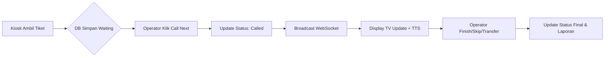

# Product Requirement Document (PRD)
**Nama Produk:** Sistem Antrian Teller/CS (Queue Counter System)  
**Versi:** 1.0  
**Tanggal:** 24 Oktober 2025  
**Disusun oleh:** Divisi TI – Bungker Corp

---

## 1. Ringkasan Produk

Sistem ini adalah platform **antrian layanan** berbasis web yang mendukung **Kiosk (ambil tiket)**, **Operator (Teller/CS)**, dan **Display TV** untuk pemanggilan nomor antrian dengan **suara otomatis (TTS)**.  
Fitur mencakup laporan operasional, metrik finansial (biaya per tiket), dan integrasi perangkat (printer thermal, speaker TV).

**Tujuan utama:**
- Meningkatkan efisiensi layanan dan mengurangi waktu tunggu pelanggan.  
- Memberikan data akurat untuk evaluasi **kinerja SDM** dan **biaya operasional**.

---

## 2. Tujuan Bisnis dan Key Metrics

| Tujuan | KPI / Metrik | Target |
|--------|---------------|--------|
| Efisiensi pelayanan | Average waiting time | ≤ 7 menit |
| Kinerja SDM | Loket utilization | 70–85% |
| Biaya operasional | Cost per ticket | ↓ 20% dari baseline manual |
| Kepuasan pelanggan | Queue abandonment rate | < 5% |
| Kinerja sistem | Response time | < 500 ms di LAN |

---

## 3. Cakupan Produk

### 3.1 In-Scope
- Pengambilan tiket di kiosk.  
- Pemanggilan tiket (Call, Recall, Skip, Finish, Transfer).  
- Tampilan display realtime + suara panggilan (id-ID).  
- Laporan SLA & biaya per tiket.  
- Multi-cabang & multi-loket.  
- WebSockets + fallback polling.  

### 3.2 Out-of-Scope
- Mobile App native (akan direncanakan fase berikutnya).  
- Integrasi WhatsApp/Telegram notification.  
- Antrian appointment berbasis waktu (reservasi).  

---

## 4. Persona Pengguna

| Persona | Deskripsi | Tujuan |
|----------|------------|--------|
| **Customer** | Nasabah/pengunjung yang mengambil tiket | Mendapat layanan cepat & jelas |
| **Teller/CS** | Petugas loket | Memanggil tiket dan melayani dengan efisien |
| **Admin Cabang** | Pengelola operasional harian | Mengatur layanan & memantau data |
| **Manajer Keuangan** | Manajemen pusat | Analisis biaya, SLA, dan utilisasi |

---

## 5. Fitur Utama

### 5.1 Modul Kiosk
- Pilih layanan (Teller/CS).
- Generate nomor tiket (format A-001, B-015, dll).
- (Opsional) Cetak tiket via printer thermal.
- Reset nomor otomatis setiap hari.

### 5.2 Modul Operator (Teller/CS)
- Login operator sesuai role.
- Tombol Call Next, Recall, Skip, Finish, Transfer.
- Tampilan tiket aktif & riwayat.
- Rekam waktu panggilan dan penyelesaian.
- Audit log setiap aksi.

### 5.3 Modul Display
- Menampilkan nomor dipanggil dan loket tujuan.
- Text-to-Speech otomatis “Nomor antrian A-015 menuju Loket 2.”
- Riwayat 5 panggilan terakhir.
- Tampilan kontras tinggi, cocok untuk TV.

### 5.4 Modul Admin & Monitoring
- CRUD cabang, layanan, loket, user.
- Konfigurasi template suara, reset, dan parameter biaya.
- Dashboard: SLA, jumlah tiket, biaya per tiket, utilisasi loket.
- Ekspor laporan ke CSV/Excel.

---

## 6. Alur Pengguna (Flow)

---

## 7. Kebutuhan Teknis

| Komponen | Teknologi |
|-----------|------------|
| Backend | Laravel 11 (PHP 8.3) |
| Database | MySQL / MariaDB |
| Cache / Queue | Redis |
| Realtime | Laravel WebSockets / Soketi |
| Frontend | Blade / HTMX / Alpine.js |
| Hosting | Nginx + Supervisor |
| Suara | Web Speech API (id-ID) atau gTTS/Polly |
| Format laporan | CSV / Excel |

---

## 8. Integrasi & API

| Endpoint | Deskripsi |
|-----------|------------|
| `POST /api/tickets` | Membuat tiket baru |
| `POST /api/counters/{id}/call-next` | Panggil tiket berikutnya |
| `POST /api/calls/{id}/finish` | Menandai tiket selesai |
| `POST /api/calls/{id}/recall` | Memanggil ulang tiket |
| `GET /api/reports` | Mengambil data laporan per hari |

---

## 9. Acceptance Criteria

| No | Fitur | Kriteria Sukses |
|----|--------|----------------|
| 1 | Generate tiket | Tiket muncul dengan kode dan waktu ambil |
| 2 | Call next | Display update dalam < 0.5s dan suara terdengar |
| 3 | Display realtime | TV menampilkan nomor + loket aktif |
| 4 | Laporan | Rata-rata waktu tunggu dan jumlah tiket tampil benar |
| 5 | Role-based access | Admin, Teller, CS, Viewer berfungsi sesuai izin |

---

## 10. User Story Backlog

### Modul: Kiosk
- **US-01:** Sebagai pelanggan, saya ingin memilih jenis layanan agar mendapatkan nomor tiket sesuai antrian.  
- **US-02:** Sebagai pelanggan, saya ingin melihat nomor tiket saya di layar agar tahu urutan saya.  
- **US-03:** Sebagai admin, saya ingin nomor antrian reset setiap hari agar tidak bentrok.

### Modul: Operator
- **US-04:** Sebagai teller, saya ingin memanggil tiket berikut agar bisa melayani pelanggan.  
- **US-05:** Sebagai CS, saya ingin memanggil ulang tiket sebelumnya agar pelanggan tidak tertinggal.  
- **US-06:** Sebagai teller, saya ingin menandai tiket selesai untuk mencatat SLA.  
- **US-07:** Sebagai teller, saya ingin melewati tiket agar bisa lanjut ke pelanggan berikutnya.

### Modul: Display
- **US-08:** Sebagai pelanggan, saya ingin mendengar nomor saya dipanggil agar saya tahu giliran saya.  
- **US-09:** Sebagai admin, saya ingin tampilan TV otomatis update tanpa refresh agar antrian realtime.  

### Modul: Laporan & Finansial
- **US-10:** Sebagai manajer, saya ingin melihat biaya per tiket agar dapat menghitung efisiensi cabang.  
- **US-11:** Sebagai admin, saya ingin mengekspor laporan ke Excel agar mudah dianalisis.  
- **US-12:** Sebagai pimpinan, saya ingin melihat grafik SLA harian untuk mengevaluasi kinerja.  

### Modul: Admin
- **US-13:** Sebagai admin, saya ingin mengelola user dan role agar keamanan terjamin.  
- **US-14:** Sebagai admin, saya ingin menyesuaikan kalimat TTS agar sesuai SOP bank.

---

## 11. Rencana Rilis

| Fase | Fitur | Estimasi |
|-------|--------|-----------|
| **Sprint 1** | Kiosk, Operator, Display MVP | 2 minggu |
| **Sprint 2** | Realtime WebSocket, Audit Log, RBAC | 2 minggu |
| **Sprint 3** | Laporan & Analitik Finansial | 3 minggu |
| **Sprint 4** | Polishing UI, TTS server-side, Testing & Deploy | 2 minggu |

---

## 12. Risiko & Mitigasi

| Risiko | Dampak | Mitigasi |
|---------|---------|----------|
| WebSocket gagal | Realtime tidak update | Fallback polling |
| Printer thermal error | Tiket tidak tercetak | Cetak ulang via kiosk |
| Data overload | Query lambat | Index DB & Redis cache |
| Salah role operator | Keamanan terganggu | RBAC & audit log |

---

## 13. Referensi
- Dokumen SRS: [`srs_counter.md`](./README.md)  
- Panduan Web Speech API (MDN)  
- Laravel WebSockets Documentation  

---
**Disusun oleh:**  
_M. Ali Murtaza_  
Divisi TI – Bungker Corp  
