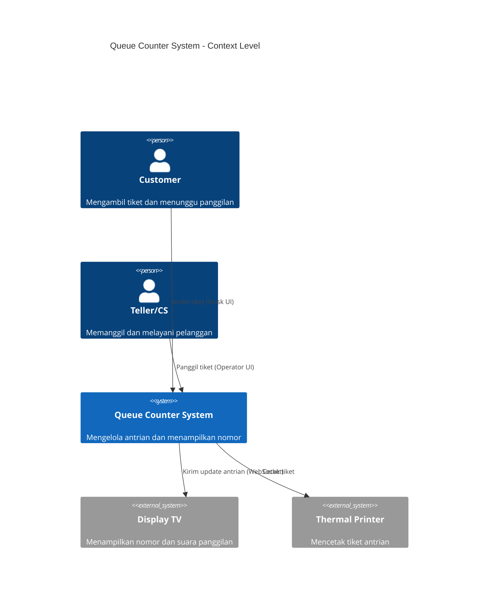
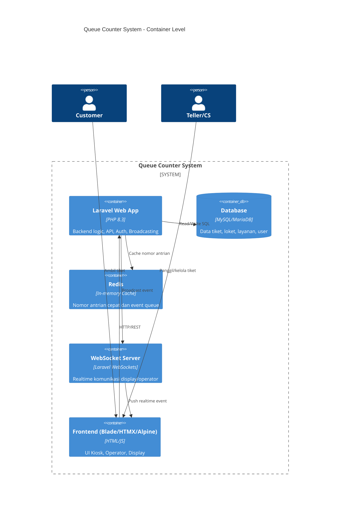
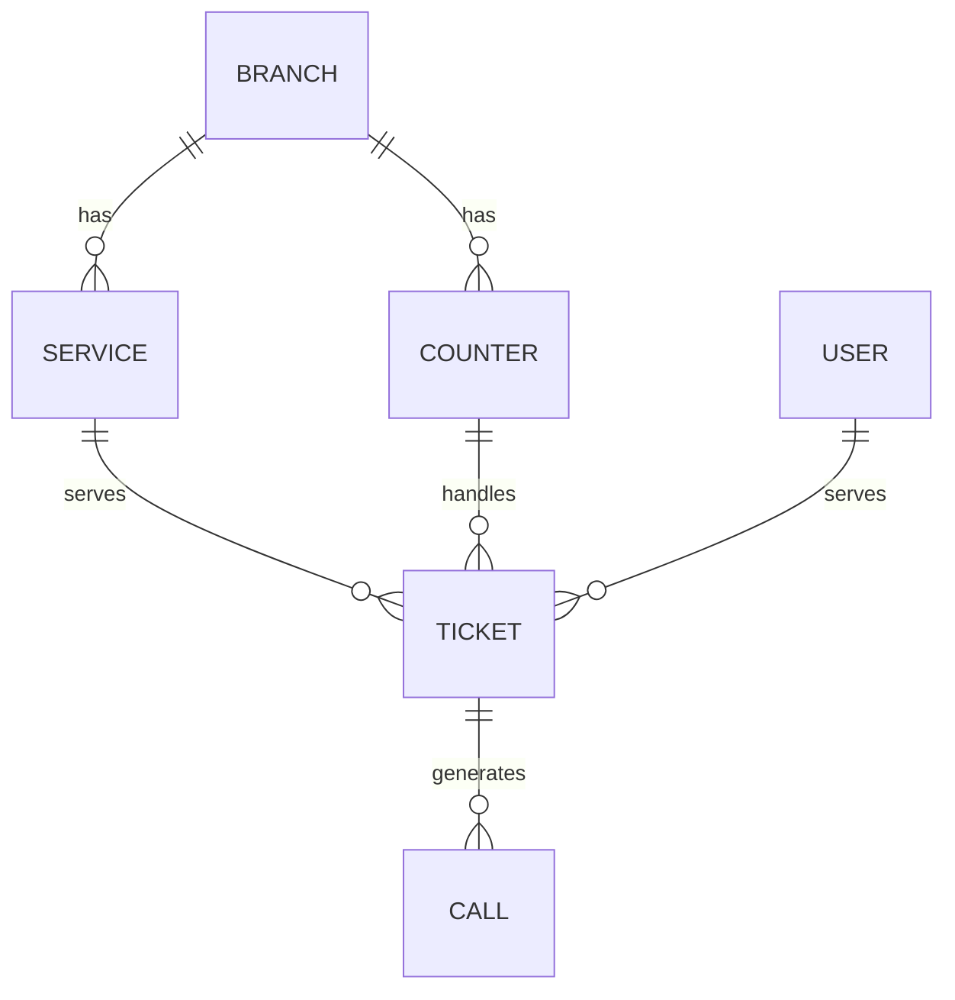
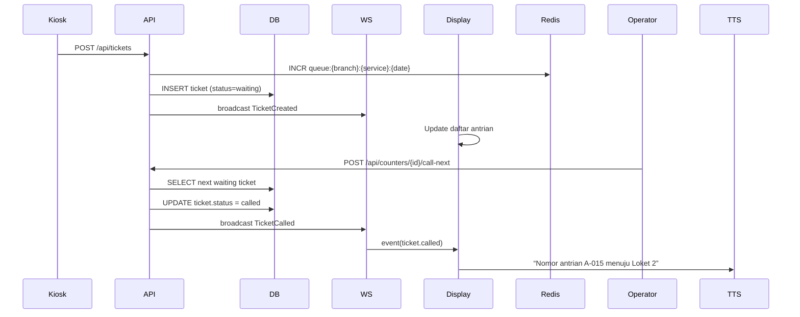

# 1.Software Design Document (SDD)
**Nama Sistem:** Sistem Antrian Teller/CS (Queue Counter System)  
**Versi:** 1.0  
**Tanggal:** 24 Oktober 2025  
**Disusun oleh:** Divisi TI – Bungker Corp  

---

## 1. Pendahuluan

### 1.1 Tujuan
Dokumen ini menjelaskan rancangan teknis dari sistem antrian Teller/CS berbasis web.  
Tujuan utama SDD adalah:
- Menjabarkan bagaimana kebutuhan dalam `srs_counter.md` diimplementasikan.
- Menjadi panduan bagi tim pengembang dan DevOps dalam implementasi, testing, dan deployment.

### 1.2 Ruang Lingkup
Desain sistem mencakup:
- Arsitektur aplikasi (backend, frontend, database, dan komunikasi realtime).
- Struktur modul Laravel dan dependensi utama.
- Model data dan relasi.
- Sequence flow dan event broadcasting.
- Konfigurasi deployment dan keamanan.

---

## 2. Arsitektur Sistem

### 2.1 Diagram C4 – Level 1 (Context Diagram)


---

### 2.2 Diagram C4 – Level 2 (Container Diagram)


---

## 3. Struktur Aplikasi

### 3.1 Struktur Direktori Laravel
```
/app
 ├── Events/
 │    ├── TicketCreated.php
 │    └── TicketCalled.php
 ├── Http/
 │    ├── Controllers/
 │    │    ├── TicketController.php
 │    │    ├── CounterController.php
 │    │    ├── CallController.php
 │    │    └── ReportController.php
 │    ├── Middleware/
 │    └── Requests/
 ├── Models/
 │    ├── Ticket.php
 │    ├── Counter.php
 │    ├── Service.php
 │    ├── Branch.php
 │    ├── Call.php
 │    └── User.php
 ├── Broadcasting/
 │    ├── TicketChannel.php
 ├── Services/
 │    ├── QueueService.php
 │    └── ReportService.php
 ├── Policies/
 │    └── RolePolicy.php
/resources
 ├── views/
 │    ├── kiosk.blade.php
 │    ├── operator.blade.php
 │    └── display.blade.php
/database
 ├── migrations/
 ├── seeders/
 └── factories/
```

---

## 4. Desain Basis Data

### 4.1 Entity Relationship Diagram (ERD)


### 4.2 Spesifikasi Tabel

| Tabel | Deskripsi | Kolom Utama |
|--------|------------|-------------|
| branches | Cabang atau lokasi kantor | id, name |
| services | Jenis layanan (Teller/CS) | id, branch_id, code, name |
| counters | Loket pelayanan | id, branch_id, name, service_id |
| tickets | Tiket antrian | id, branch_id, service_id, number_int, code, status, called_at |
| calls | Log panggilan tiket | id, ticket_id, counter_id, action, created_at |
| users | Operator/Admin | id, name, role, counter_id |

---

## 5. Desain Komponen

### 5.1 Komponen Backend
| Komponen | Fungsi |
|-----------|---------|
| `TicketController` | Generate tiket baru, reset harian |
| `CounterController` | Call next, recall, skip, transfer |
| `CallController` | Menyimpan log setiap aksi operator |
| `ReportController` | Menghitung waktu tunggu & biaya per tiket |
| `QueueService` | Mengatur nomor antrian via Redis |
| `ReportService` | Perhitungan metrik finansial (cost per ticket) |

---

## 6. Komunikasi & Alur Data

### 6.1 Sequence Diagram (Generate → Call → Display)


---

## 7. Keamanan

- HTTPS wajib di semua endpoint.  
- Autentikasi JWT/session Laravel.  
- Role-based Authorization (Admin, Teller, CS, Viewer).  
- CSRF protection aktif di semua form.  
- Rate limit pada API `/tickets`.  
- Audit log semua aksi operator di tabel `calls`.  

---

## 8. Desain UI (Wireframe Sederhana)

### 8.1 Kiosk
```
+-----------------------------------+
| PILIH LAYANAN                     |
| [ Teller ]    [ Customer Service ]|
|-----------------------------------|
| Nomor Anda: A-015                 |
| Harap menunggu panggilan di layar |
+-----------------------------------+
```

### 8.2 Operator
```
+-----------------------------------+
| Loket 2 - Teller                  |
|-----------------------------------|
| Tiket Sekarang: A-015             |
| [Call Next] [Recall] [Finish]     |
| [Skip] [Transfer] [No Show]       |
|-----------------------------------|
| Riwayat: A-012 Done, A-013 Done   |
+-----------------------------------+
```

### 8.3 Display TV
```
+-----------------------------------------------+
|    NOMOR DIPANGGIL      |       LOKET         |
|-----------------------------------------------|
|        A-015            |        2            |
|-----------------------------------------------|
| A-014 | Loket 1 | 10:12 |                     |
| A-013 | Loket 2 | 10:10 |                     |
| ...                                         ...|
+-----------------------------------------------+
```

---

## 9. Deployment & Infrastruktur

### 9.1 Lingkungan
| Komponen | Rekomendasi |
|-----------|-------------|
| OS | Ubuntu 22.04 LTS |
| Web Server | Nginx + PHP-FPM 8.3 |
| DB | MariaDB 10.5+ atau MySQL 8 |
| Cache | Redis 7 |
| Realtime | Laravel WebSockets (port 6001) |
| Queue Worker | Supervisor service |
| SSL | Let’s Encrypt / Cloudflare |

### 9.2 Struktur Deployment
```
/var/www/queue-counter/
 ├── public/                # web root
 ├── storage/
 ├── .env
 ├── artisan
 ├── supervisor.d/
 │    ├── queue-worker.conf
 │    └── websockets.conf
 └── nginx/
      └── queue-counter.conf
```

### 9.3 Supervisor Config Contoh
```
[program:queue-counter-worker]
command=php /var/www/queue-counter/artisan queue:work --sleep=3 --tries=3
autostart=true
autorestart=true

[program:queue-counter-websockets]
command=php /var/www/queue-counter/artisan websockets:serve
autostart=true
autorestart=true
```

---

## 10. Rencana Pengujian Teknis

| Jenis Test | Tujuan | Tools |
|-------------|--------|-------|
| Unit Test | Validasi fungsi penomoran & status tiket | PHPUnit |
| Integration Test | Simulasi call-next & display update | Laravel Dusk / Postman |
| Load Test | Tes 1000 tiket / hari | k6 / JMeter |
| Failover Test | Putus koneksi WS | Manual check fallback polling |
| Security Test | Autentikasi & XSS check | OWASP ZAP |

---

## 11. Rencana Pemeliharaan
- Log rotation otomatis (`storage/logs`).  
- Backup database harian via `cron` ke NAS.  
- Health check service (`/api/health`).  
- Monitoring uptime (Uptime Kuma / Grafana Loki).  
- Dokumentasi versi di `CHANGELOG.md`.

---

## 12. Revisi & Versi
| Versi | Tanggal | Perubahan | Penulis |
|--------|----------|-----------|----------|
| 1.0 | 24/10/2025 | Draft awal SDD | M. Ali Murtaza |

---

**Disusun oleh:**  
_M. Ali Murtaza_  
Divisi TI – Bungker Corp
